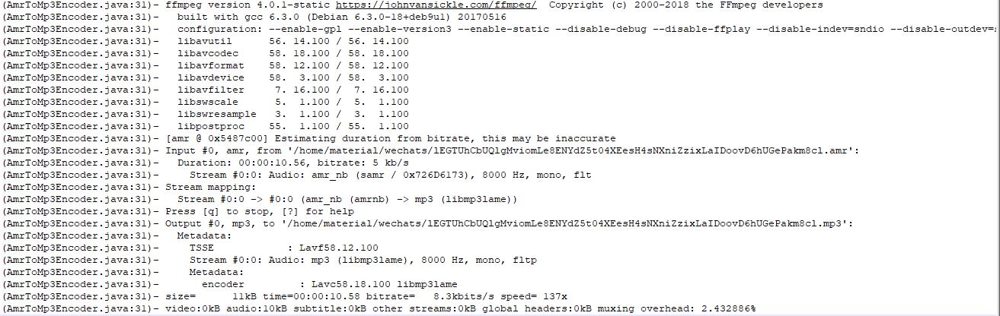

# 记录解决微信amr文件转mp3格式的过程

我们在做微信语音上传功能开发时,因为微信的原因，音频文件在微信服务端只能存储3天,所以,我们需要根据微信的serverId，使用微信公众平台的接口将音频文件下载下来,存储到我们本地的服务器

由于微信的音频文件格式是amr格式，该格式在HTML5页面是不支持播放的,此时,我们需要将amr格式装换为mp3格式

利用jave的工具包可以实现次目的，由于jave并未上传中央仓库,官网下载地址：http://www.sauronsoftware.it/projects/jave/download.php

此次使用jave的工具包主要碰到两个问题：

> 抛异常 it.sauronsoftware.jave.EncoderException:   Duration: N/A, bitrate: N/A
>
> 抛异常it.sauronsoftware.jave.EncoderException:   **Stream mapping:** 

使用搜索帮助，主要发现两篇有价值的博文：

- [java amr格式转mp3格式(完美解决Linux下转换0K问题)](https://blog.csdn.net/z313731418/article/details/50218341)

- [解決linux AMR轉MP3出現轉碼成功卻無法播放的問題](https://hk.saowen.com/a/2ec2a73ec73091967c3ebdb5697832006cb255a7183377b6e8fae1c13f5e54bc)

结合以上两篇博客的解决方案,主要做如下步骤：

1.下载jave的最新src代码(该库09年已停止维护)，导入maven工程

2.下载最新的ffmpeg程序,[ffmpeg下载地址](http://ffmpeg.org/download.html),替换jave中默认的ffmpeg程序

3.重新打包,`mavn install`

最终控制台调试 打印log如下：



Java代码使用示例：

```java
TemplateDownloadMaterial tm=weixinService.downloadTempMaterial(media,file.getAbsolutePath());
if (tm!=null&&tm.getFile()!=null){
	//判断是否是amr格式
    //tm.getFile 文件为微信下载下来的amr格式文件
	if (tm.getFile().getName().endsWith("amr")){
		String fileName=tm.getFile().getName();
		String newName=fileName.substring(0,fileName.lastIndexOf("."));
		File dest=new File(tm.getFile().getParent()+File.separator+newName+".mp3");
		AudioUtils.getAmrConversionMp3(tm.getFile().getAbsolutePath(),dest.getAbsolutePath());
		log("转换音频mp3成功");
		tm.getFile().deleteOnExit();
		tm.setFile(dest);
	}
}
```

修改后的jave源码地址：https://github.com/xiaoymin/jave

下载后 ，`mvn install`后可以执行使用


